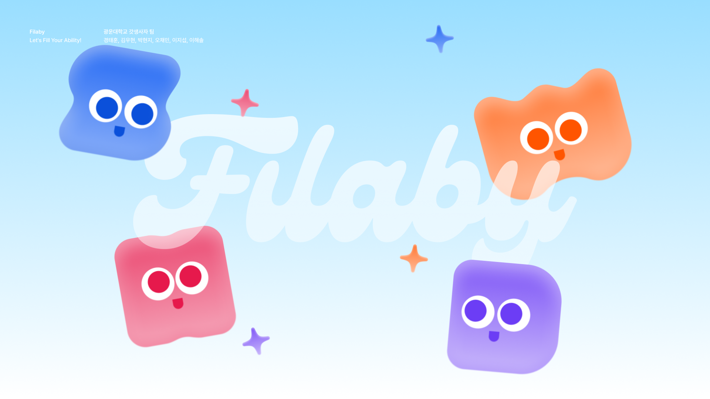
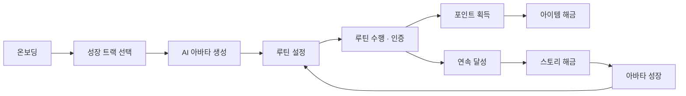
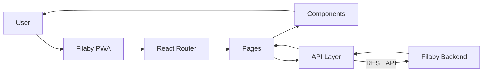
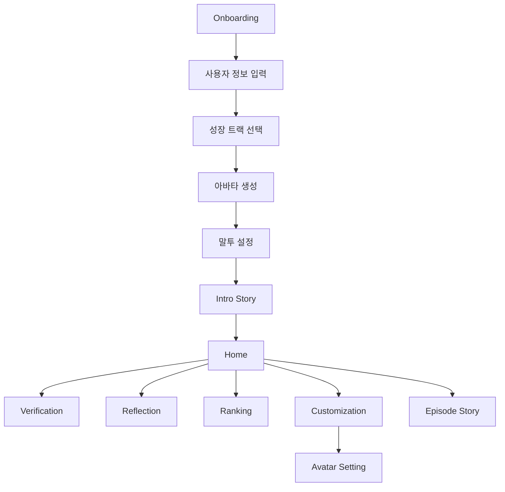

<div align="center">
  

  <br />
  <br />

  <h1>Filaby Frontend</h1>

  <p><strong>Let's Fill Your Ability!</strong></p>

  <p>
    또 다른 나와 함께 채워가는 매일의 가능성.<br />
    루틴을 통해 AI 아바타와 함께 성장하는 모바일 웰니스 서비스입니다.
  </p>

  <p>
    <a href="https://godlife.likelion.uk/"><strong>서비스 체험</strong></a>
    ·
    <a href="https://github.com/likelion-kwu/14th-hackathon-team2-backend"><strong>Backend</strong></a>
  </p>
</div>

> **Naming note** — 최종 사용자 노출명은 **Filaby**입니다.  
> 일부 저장소 및 기획 과정에서는 프로젝트 코드명 **갓생사자(Godlife-Lion)** 를 사용합니다.

---

## Why Filaby?

건강한 생활 습관과 루틴은 꾸준히 실천해야 변화를 확인할 수 있지만,
단기간에는 결과가 잘 보이지 않아 쉽게 포기하게 됩니다.

Filaby는 사용자의 작은 행동을 **루틴 인증**, **AI 아바타**, **포인트와 아이템**, **스토리 성장**으로 연결하여
꾸준한 실천 자체가 하나의 경험이 되도록 설계했습니다.

사용자는 루틴을 수행하며 또 다른 세계의 나인 아바타와 함께 성장하고,
지속적인 행동을 통해 새로운 아이템과 스토리를 해금할 수 있습니다.

---

## Core Experience



---

## Main Features

### Onboarding

사용자는 별도의 회원가입 없이 Filaby를 시작할 수 있습니다.

- 게스트 세션 생성
- 이름 및 닉네임 입력
- 성장 트랙 선택
- 얼굴 사진 등록
- AI 아바타 생성
- 아바타 말투 설정
- 온보딩 진행 상태에 따른 화면 이동

### AI Avatar

사용자의 얼굴과 선택한 성장 트랙을 기반으로 생성된 아바타를 확인할 수 있습니다.

- 서버에서 생성된 아바타 이미지 표시
- 아바타 터치 시 상황별 대사 출력
- 아바타 말투 및 응답 스타일 설정
- 성장에 따른 아바타 경험 제공

### Routine

매일 수행할 루틴을 확인하고 관리할 수 있습니다.

- 오늘의 루틴 조회
- 루틴 추가 및 수정
- 추천 루틴
- TODO 관리
- 루틴 진행 상태 표시
- Bottom Sheet 기반 루틴 UI

### Verification

루틴에 따라 사진 또는 체크 방식으로 인증할 수 있습니다.

- 사진 촬영 및 인증
- CHECK 기반 인증
- 인증 상태 표시
- 완료된 루틴 UI 반영

### Avatar Customization

획득한 아이템을 아바타에 장착할 수 있습니다.

- 아이템 도감
- 해금 / 미해금 상태 표시
- 아이템 장착 및 해제
- 미해금 아이템 해금 UI
- 장착 상태 표시

### Story

루틴을 꾸준히 수행하면 Filaby의 스토리가 해금됩니다.

- Intro Story
- Episode Story
- 에피소드별 이미지 시퀀스
- 자동 재생 및 터치 전환
- 스토리 해금 팝업
- 연속 달성 기반 에피소드 해금

### Reflection

지금까지의 루틴 수행 기록을 확인할 수 있습니다.

- 월간 기록
- 루틴 성공 / 실패 상태
- 연속 달성 기록
- 성장 진행도

### Ranking

다른 사용자와 함께 루틴을 지속할 수 있도록 랭킹을 제공합니다.

- 월간 랭킹
- 상위 랭커 표시
- 내 순위 확인
- 획득 포인트 기반 경쟁

---

## Tech Stack

| Category | Technology |
|---|---|
| Core | React |
| Build | Vite |
| Language | JavaScript |
| Routing | React Router |
| Server State | TanStack Query |
| Styling | CSS |
| PWA | vite-plugin-pwa |
| API | REST API · Fetch |
| Deployment | Static Build (`dist`) |
| Collaboration | Git · GitHub |

---

## Architecture



프론트엔드는 페이지와 UI 컴포넌트, API 통신 영역을 분리하여 구성했습니다.

서버 데이터는 API Layer를 통해 접근하며,
페이지에서는 서버 응답을 화면에서 사용할 수 있는 형태로 변환하여 렌더링합니다.

---

## Project Structure

```text
src
├── api
│   ├── apiClient.js
│   ├── avatarApi.js
│   ├── homeApi.js
│   ├── routineApi.js
│   ├── sessionApi.js
│   ├── speechStyleApi.js
│   ├── storyApi.js
│   └── userApi.js
│
├── assets
│   ├── avatar
│   ├── icons
│   ├── onboarding-page
│   ├── story
│   └── ...
│
├── components
│   ├── back-button
│   ├── bottom-button
│   ├── chat-bubble
│   ├── icon
│   ├── main-layout
│   └── navigation
│
├── pages
│   ├── avatarset-page
│   ├── customize-page
│   ├── home-page
│   ├── inputinfor-page
│   ├── onboarding-page
│   ├── ranking-page
│   ├── reflection-page
│   ├── setting-page
│   ├── story-page
│   ├── tracksetting-page
│   └── verification-page
│
├── router
│   └── AppRouter.jsx
│
├── styles
├── App.jsx
└── main.jsx
```

---

## Page Flow



---

## API Communication

백엔드 API 호출은 `src/api`에서 관리합니다.

```text
Page
 ↓
API Function
 ↓
apiClient
 ↓
Filaby Backend
```

예를 들어 사용자 정보는 다음과 같이 분리되어 있습니다.

```js
import { apiRequest } from './apiClient'

export function getCurrentUser() {
  return apiRequest('/users/me')
}

export function updateNickname(nickname) {
  return apiRequest('/users/me', {
    method: 'PATCH',
    body: {
      nickname,
    },
  })
}
```

이를 통해 페이지 컴포넌트가 직접 HTTP 요청 로직을 관리하지 않도록 구성했습니다.

---

## PWA

Filaby는 모바일 환경에서 앱과 유사한 경험을 제공하기 위해 PWA로 구성했습니다.

`vite-plugin-pwa`를 사용하며 다음 기능을 제공합니다.

- 모바일 홈 화면 설치
- Standalone 실행
- Web App Manifest
- Service Worker
- 정적 리소스 캐싱
- 모바일 브라우저 기반 카메라 기능

Manifest의 기본 설정은 다음과 같습니다.

```js
VitePWA({
  registerType: 'autoUpdate',

  manifest: {
    name: 'Filaby',
    short_name: 'Filaby',
    description: '루틴을 통해 또 다른 나와 함께 성장하는 웰니스 서비스',

    start_url: '/',
    display: 'standalone',

    background_color: '#ffffff',
    theme_color: '#4DC4FF',
  },
})
```

---

## Getting Started

### Prerequisites

- Node.js
- pnpm

### 1. Clone

```bash
git clone https://github.com/likelion-kwu/14th-hackathon-team2-frontend.git

cd 14th-hackathon-team2-frontend
```

### 2. Install

```bash
pnpm install
```

### 3. Development

```bash
pnpm run dev
```

Vite 개발 서버가 실행되면 출력된 주소에서 서비스를 확인할 수 있습니다.

---

## Build

프로덕션 빌드는 다음 명령어로 생성합니다.

```bash
pnpm run build
```

빌드가 완료되면 프로젝트 루트에 다음과 같이 `dist`가 생성됩니다.

```text
dist/
├── assets/
├── index.html
├── manifest.webmanifest
├── sw.js
└── ...
```

배포 서버에서는 이 `dist` 디렉터리의 정적 파일을 제공합니다.

로컬에서 프로덕션 빌드를 확인하려면:

```bash
pnpm run preview
```

---

## Git Convention

기능 개발은 별도의 브랜치에서 진행합니다.

```text
main
 └── feat/*
```

작업 예시:

```bash
git checkout -b feature/home
git add .
git commit -m "feat: 홈 화면 구현"
git push -u origin feat/10-home
```

Pull Request를 통해 코드 리뷰 후 `main` 브랜치에 반영합니다.

---

## Responsive Design

Filaby는 모바일 사용을 중심으로 설계했습니다.

주요 UI는 다음과 같은 모바일 환경을 고려하여 구현했습니다.

- 모바일 viewport 대응
- `100svh` 기반 화면 높이
- Bottom Navigation
- Bottom Sheet
- Touch / Pointer Event
- 이미지 드래그 방지
- 스크롤바 숨김
- PWA standalone 환경

---

## Repository

| Repository | Description |
|---|---|
| Frontend | `14th-hackathon-team2-frontend` |
| Backend | `14th-hackathon-team2-backend` |

---

<div align="center">
  <strong>Filaby</strong> · 2026 멋쟁이사자처럼 중앙해커톤<br />
  광운대학교 갓생사자 팀
</div>
